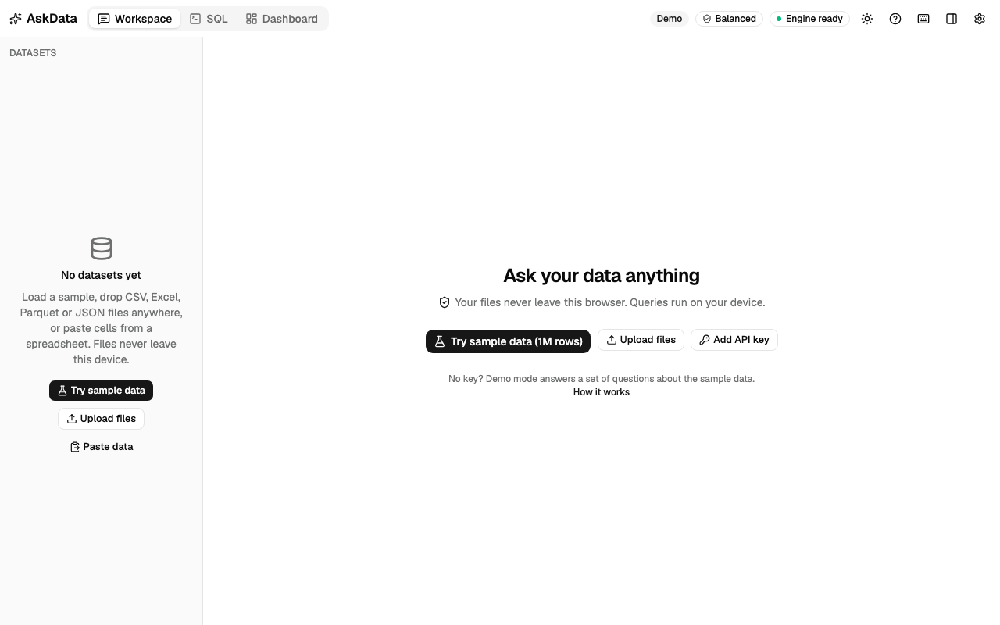
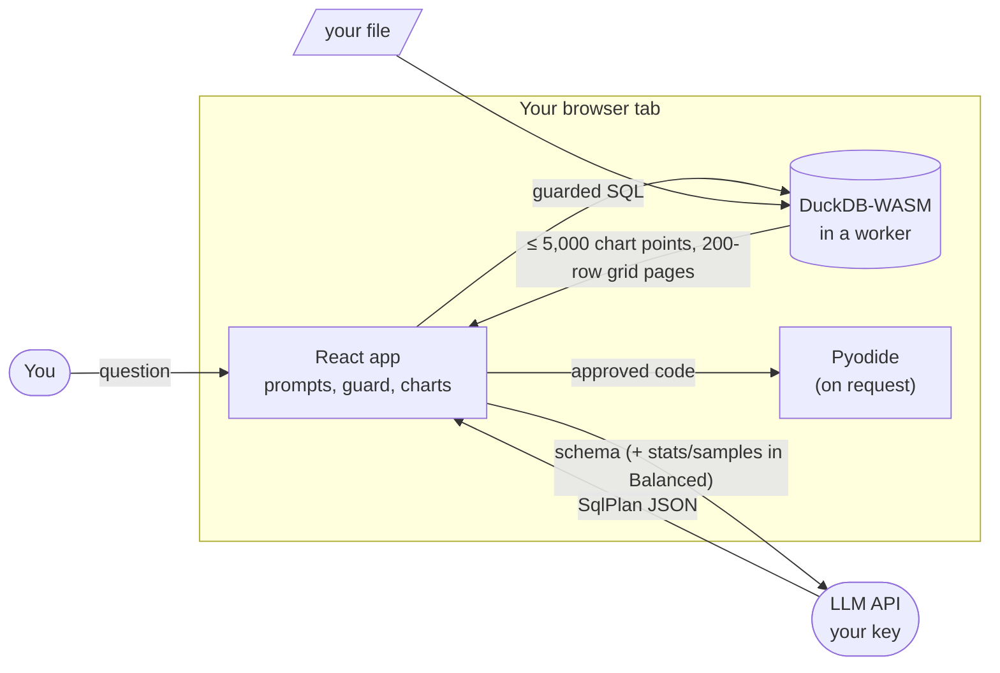

# AskData

**Ask your data questions in plain English. Your file never leaves your browser.**

<!-- Live demo: add the Vercel URL here after the first deploy (see docs/DEPLOY.md). -->



AskData is an AI data analyst that runs entirely in the browser: load a CSV, Excel, Parquet or JSON
file, ask a question, and get a chart, a table and a short explanation. An LLM writes DuckDB SQL from
your question, and DuckDB-WASM runs it on your device, so the rows stay with you. Only what the
privacy mode allows (column names, and optionally a few statistics and sample values) goes to the AI
provider you choose, with your own key, and every request is shown in an inspector exactly as sent.

No key? Demo mode answers a set of questions about a generated 1M-row sales dataset, with live SQL.

## What it does

- **Ask in plain English**: questions become SQL, a chart picked by rules (with the AI's hint when it
  fits the result), a summary, and follow-ups that remember the last three turns. The AI can look at
  the data first (up to three small queries) and uses join keys it finds between your tables.
- **Check every answer**: editable SQL, assumptions, a step-by-step trace, and "What the AI saw" for
  every request. Wrong SQL is fixed automatically (up to twice) using DuckDB's error.
- **1M+ rows without freezing**: queries run in a worker; the grid pages results from DuckDB, with
  sorting and filters pushed down to SQL.
- **Dashboards**: pin answers or generate a dashboard, drag and resize tiles, filter every tile at
  once (or click a bar), present full screen, export as JSON or a standalone HTML/PDF report.
- **Python when SQL isn't enough**: forecasts, regressions and outliers run as pandas in Pyodide, only
  after you approve the code, with the network blocked. A notebook in the scratchpad runs your own
  cells, with matplotlib charts.
- **Your data, your rules**: Strict or Balanced privacy, a local model server (Ollama, LM Studio)
  instead of a cloud API, business notes for context, optional file keeping, workspace export,
  "Clear all local data".

## How it works



Every AI-written query passes an AST-based SQL guard before it runs: one read-only SELECT, only your
tables, no `ATTACH`, `COPY`, `INSTALL`, `LOAD`, `SET` or `PRAGMA`. DuckDB's extension autoloading is
switched off. Details, threading and a sequence diagram of the pipeline:
[docs/ARCHITECTURE.md](docs/ARCHITECTURE.md).

### What the AI receives

| Mode | Sent to the provider |
|---|---|
| Demo (no key) | Nothing. Answers are recorded plans; their SQL runs live in your browser. |
| Local server | The Strict or Balanced payload, to a model server on your own computer. |
| Strict | Table and column names and types, row counts, your notes. No values, no results. |
| Balanced (default) | Strict, plus per-column statistics, up to 5 common values, 3 sample rows (text cut to 40 characters), and the answer's result (≤ 50 rows, or a digest) for the AI summary. |

Data values are treated as untrusted text: they're sent as JSON inside a delimited block the model is
told never to follow. A production Content-Security-Policy limits network access to the two LLM APIs,
the two CDNs (Pyodide, DuckDB extensions) and servers on your own computer, and an end-to-end test
checks it on the built app.

## Performance

Measured with the in-app benchmark (`/#/bench`) on the production build, on localhost: headless
Chrome 153, 10 cores, 1,000,000 rows (14 columns).

| Metric | Result | Budget |
|---|---|---|
| DuckDB ready after page load | 0.36 s | < 3 s |
| Generate the 1M-row sample | 0.78 s | < 5 s |
| Ingest a 102 MB CSV | 0.56 s | ≤ 15 s |
| Aggregation query, p50 / p95 | 20 ms / 23 ms | p95 < 500 ms |
| Chart render, 5,000 points | 2.7 ms | < 100 ms |
| Grid scroll through 1M rows | no long tasks | none > 50 ms |
| Initial JavaScript (gzip) | 269 KB | ≤ 350 KB |

Download time over a real network isn't included (DuckDB's wasm is about 8 MB gzipped, cached
after the first visit). Run the
benchmark on your machine at `/#/bench` and copy the results as Markdown.

## NL→SQL evaluation

`evals/questions.jsonl` holds 53 questions over the Global Sales sample and an HR dataset, each with a
reference query, including three the data can't answer. The runner sends each question through the
real pipeline (same prompts, guard and self-correction as the app), runs the generated and reference
SQL on the same data, and compares results: **execution accuracy**, not string match. Column names and
order don't matter, extra columns are allowed, and numbers match within 1e-6 or when rounded.

```sh
ANTHROPIC_API_KEY=sk-ant-… npm run evals   # writes evals/report.md
EVAL_DRY_RUN=1 npm run evals               # checks the harness itself, no key: 53/53
```

Accuracy with a real model hasn't been measured yet.

## Run it

Requires Node 24.

```sh
npm ci
npm run dev        # http://localhost:5173
```

Click **Try sample data** and ask one of the suggested questions (demo mode), or add an Anthropic or
OpenAI key in Settings to ask anything about your own files.

| Command | What it does |
|---|---|
| `npm run check` | typecheck, lint, unit tests, build, bundle-size budget (what CI runs) |
| `npm test` | unit tests (Vitest; real DuckDB through its Node build) |
| `npx playwright install chromium && npm run e2e` | end-to-end tests in demo mode, no key needed |
| `npm run evals` | NL→SQL evals (see above) |
| `node scripts/record-demo.mjs` | re-record `docs/demo.png` after `npm run build` |

Deploying: [docs/DEPLOY.md](docs/DEPLOY.md) (Vercel; any static host that serves `.wasm` as
`application/wasm` works).

## Decisions and trade-offs

- **DuckDB-WASM rather than SQLite (sql.js)**: columnar and vectorized, so aggregations over 1M rows
  take milliseconds. It reads CSV, Parquet and JSON natively, and its parser gives the SQL guard a
  real AST (`json_serialize_sql`) instead of regexes.
- **Bring your own key, called from the browser**: no server to run or trust, and the user decides
  what to share. The cost is that the key lives in the page; it stays in memory unless the user opts
  in to remembering it, and the CSP limits where it can be sent.
- **No COOP/COEP headers**: DuckDB runs single-threaded, but the app works on any static host, and
  the CDNs and LLM APIs don't need cross-origin isolation headers. Queries are fast enough that the
  trade is worth it.
- **Rules first for charts**: the chart type comes from the result's shape (deterministic and
  testable); the model's suggestion is used only when it's compatible with the data.
- **Privacy modes are tested, not promised**: only one module builds payloads, and an end-to-end test
  asserts that Strict requests contain no values.
- **Python is opt-in per run**: Pyodide is about 20 MB and code from a model shouldn't run unseen, so
  it loads on first use and waits for the user's approval.

More in [docs/PRD.md §12](docs/PRD.md) (80+ recorded decisions).

## Stack

React 19, TypeScript, Vite, Tailwind CSS v4 and shadcn/ui · DuckDB-WASM · LangChain.js (Anthropic,
OpenAI) with Zod-validated structured output · ECharts · TanStack Table and Virtual ·
react-grid-layout · CodeMirror · Pyodide · SheetJS · Zustand · Vitest and Playwright.
