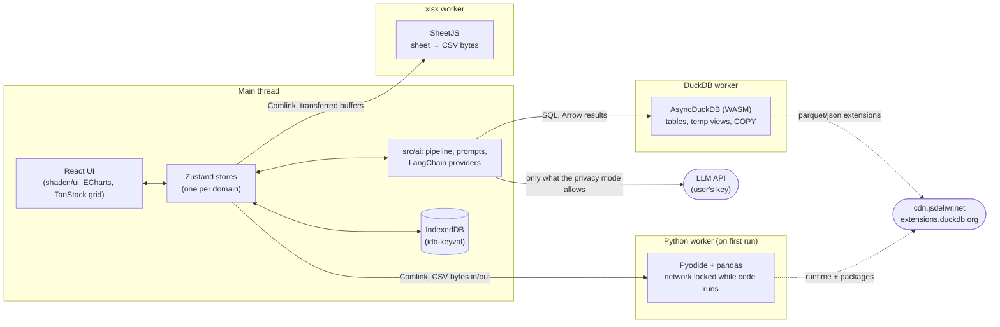
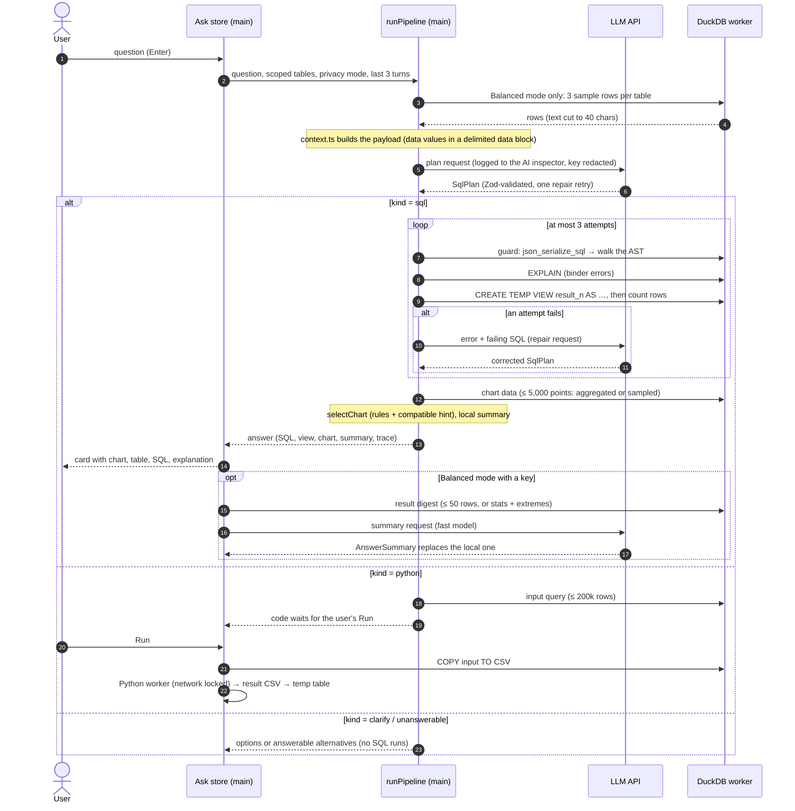

# AskData architecture

AskData is a static single-page app with no backend. Your files are loaded into DuckDB-WASM inside the
browser tab. The only network traffic is the AI provider you pick, with your own key, plus the pinned
CDNs for Pyodide and DuckDB's parquet/json extensions. This document covers where code runs, what an
answer goes through, and where data may cross the device boundary. Requirements and feature IDs live
in [PRD.md](PRD.md); the decisions behind them are in its §12 (`D1`…).

## Threading model

| Where | What runs there | Why |
|---|---|---|
| Main thread | React, Zustand, prompt building, LLM calls (network I/O only), chart options | Nothing in this list is CPU-heavy; ECharts gets ≤ 5,000 points. |
| DuckDB worker | Ingest, profiling, every query, grid pages, exports | Columnar, vectorized SQL. Big results stay in DuckDB as temp views. |
| xlsx worker | Parsing workbooks into CSV bytes | SheetJS parsing is synchronous and slow on big files. |
| Python worker | Pyodide + pandas, after the user approves the code | Isolated; terminated on Stop or timeout; `fetch`/XHR blocked during user code. |

- DuckDB runs without threads (no COOP/COEP headers), so queries run one at a time. Grid pages are
  small and stale ones are cancelled (`src/engine/connection.ts` serial queue).
- Heavy libraries are loaded on first use with dynamic `import()`: DuckDB on idle after first paint,
  ECharts on the first chart, CodeMirror on the first SQL view, LangChain on the first question with a
  key, Pyodide on the first Python run. The landing page ships 269 KB of gzipped JS
  (`e2e/lazy.spec.ts` checks the deferral).
- `src/ai`, `src/charts`, `src/dashboard` and most of `src/engine` are pure TypeScript with no React or
  DOM. They run in Node for unit tests (with DuckDB's Node build) and for the evals runner.

## The ask pipeline

`src/ai/pipeline.ts` runs these stages in a fixed order. Each stage reports to the answer's trace (the
"Trace" tab) and to the progress list on the card.

- **Guard** (`src/engine/sqlGuard.ts`): exactly one SELECT/WITH statement; every table is a loaded
  table or a CTE; table functions limited to `range`, `generate_series` and `unnest`; no ATTACH, COPY,
  INSTALL, LOAD, SET or PRAGMA. Extension autoload is off, so even an allowed query can't fetch
  anything.
- **Execution** (`src/engine/paging.ts`): results are never materialized in JS. The grid reads
  200-row pages from the temp view (sorted and filtered in SQL). Charts read at most 5,000 points.
- **Self-correction**: guard, EXPLAIN and execution errors go back to the model with the failing SQL,
  at most twice. After that, the user gets the error with the last SQL to edit.

## What can leave the device

| Mode | Sent to the LLM provider |
|---|---|
| Demo (no key) | Nothing. Answers are recorded plans; their SQL runs live on the device. |
| Strict | Table names, row counts, column names and types, the user's notes. No values and no results; summaries are written locally. |
| Balanced (default) | Strict, plus per-column null %, approximate distinct counts, min/max, up to 5 common values (≤ 40 chars), 3 sample rows. The AI summary gets the result (≤ 50 rows, otherwise statistics plus the first 10 and 5 highest/lowest rows). |

- Only `src/ai/context.ts` builds payloads. `e2e/ai-provider.spec.ts` asserts that a Strict request
  contains no sample values, top values, min/max or result rows.
- Every request is recorded in the AI inspector exactly as sent, with the parsed output, tokens, an
  estimated cost and latency. Key-shaped strings are scrubbed.
- API keys stay in memory unless the user ticks "Remember on this device". They are never logged,
  exported or read from build-time environment variables.
- Data values and column names are untrusted. They're JSON inside a `<data>` block with `<` and `>`
  escaped, and the prompts tell the model to treat them as data. Hostile-cell fixtures test this
  (F-SEC-05).

## Defense in depth

1. **Content-Security-Policy**, injected into `index.html` at build: `script-src 'self'
   'wasm-unsafe-eval'`, and `connect-src` limited to the two LLM APIs and the two CDNs. Zod runs
   jitless so nothing needs `eval`. `e2e/privacy.spec.ts` runs the production build and checks for no
   violations and that a third-party request is blocked.
2. **SQL guard + extension lockdown** (above).
3. **Python**: the code runs only after the user clicks Run (unless they turned on auto-run), only in
   its worker, with the network blocked. It is stopped by terminating the worker.
4. **Hosting headers** (`vercel.json`): `frame-ancestors 'none'`, `nosniff`, no referrer.

## State and persistence

Each domain has its own Zustand store (`src/stores/`). What survives a reload goes to IndexedDB as a
versioned, Zod-validated record (`src/lib/idb.ts`). A record that fails validation is backed up and
replaced by defaults, never half-loaded.

| Record | Holds |
|---|---|
| `settings` (v4) | provider, models, privacy mode, formats, auto-run, tour; the key only if remembered |
| `history` | questions and queries with their SQL and outcome (no rows) |
| `dashboards` | tiles, layout, filters, last snapshot of each tile (≤ 5,000 rows) |
| `notes` | business notes by schema hash, so re-loading the same file brings them back |
| `evalCases` | 👍/👎 cases saved from answers, exportable in the evals format |
| `suggestions` | AI-suggested questions by schema hash |

Files themselves are never stored. After a reload the user loads them again, and dashboards refresh
once a table with the same schema hash is back. "Restart engine" re-ingests the retained `File`
handles, re-applies column type overrides and reopens every answer's view.

## Dashboards

A tile stores its SQL, chart spec and a snapshot. It renders the snapshot at once, then re-runs
through `src/dashboard/run.ts` (the same guard) when its tables are loaded. Dashboard filters create
filtered views (`askdata_filtered_<table>`), and the tile SQL's table references are rewritten through
the AST to point at them (`src/engine/filters.ts`), so filters work on any tile without string editing.

## Testing

| Layer | Tool | What it covers |
|---|---|---|
| Unit (~600) | Vitest; real DuckDB via its Node build | guard, normalization, paging, profiling, chart rules, prompt snapshots, privacy context per mode, stores |
| End-to-end (60+) | Playwright, Chromium, demo mode | the user journeys, a mocked Anthropic API (real LangChain + SDK in the browser), CSP and network allow-list, lazy loading |
| Evals | `npm run evals` (Vitest + DuckDB Node) | NL→SQL execution accuracy on 53 questions over two datasets, through the real pipeline |
| Benchmark | `#/bench` in the browser | the §5 budgets on the user's machine |
